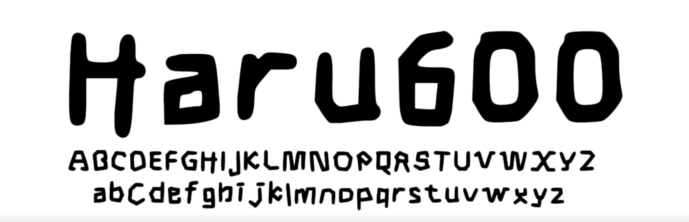

# Haru600

**Haru600** is a modern typeface designed by the content creator **HaruYT600**. Its clean, versatile style makes it perfect for use in projects, social media, branding, and more. Whether you're working on personal or professional designs, Haru600 is free to use and ready to elevate your creativity.

## Features
- Sleek and modern design
- Supports A-z, 0-9, and a few other symbols
- Ideal for social media graphics, branding, and projects of any kind

## Usage
Haru600 is free to use for:
- Personal and commercial projects
- Social media posts and graphics
- Branding, logos, and more

There are no restrictions—use it however you like!

## Installation
1. Clone this repository or download the font files (`.ttf`) from the **Releases** section.
2. Install the font on your device:
   - **Windows**: Right-click the `.ttf` file and select "Install."
   - **Mac**: Double-click the `.ttf` file and click "Install Font."
   - **Linux**: Move the `.ttf` file to the `.fonts` directory in your home folder.

## License
Haru600 is licensed under the **SIL Open Font License (OFL) v1.1**, which allows free use, modification, and distribution. For full details, see the [LICENSE.txt](LICENSE.txt) file.

## About the Creator
Haru600 is created by **HaruYT600**, a passionate content creator. Check out their work on [YouTube](https://youtube.com/@HaruYT600).

## Showcase
Here's how Haru600 looks in action:  

